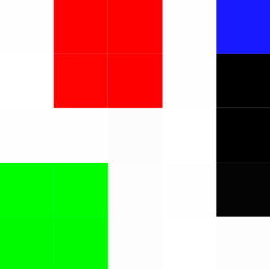
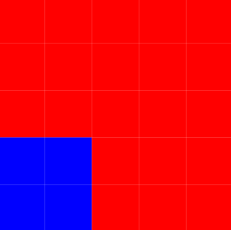

# Implementação Final da Disciplina de Grafos: Segmentação de Imagens

## Introdução
Este projeto foi desenvolvido como parte da disciplina de Teoria dos Grafos e Computabilidade na PUC Minas. O objetivo principal foi explorar e implementar dois algoritmos baseados em grafos para segmentação de imagens, inspirados por trabalhos na área:

1. **Efficient Graph-Based Image Segmentation**, de Felzenszwalb e Huttenlocher.
2. **Graph Cuts and Efficient N-D Image Segmentation**, de Boykov e Funka-Lea.

Ambos os métodos empregam estruturas de grafos para identificar segmentos em imagens, mas apresentam abordagens distintas, oferecendo um contraste interessante entre uma técnica de segmentação baseada em árvores geradoras mínimas e outra baseada em cortes em grafos.

## Metodologia
Cada implementação foi realizada seguindo uma estrutura modular para facilitar o desenvolvimento e a análise. Aqui está um resumo das abordagens adotadas:

### 1. Segmentação Baseada em Árvores Geradoras Mínimas
- A imagem foi representada como um grafo, onde cada pixel é um vértice e as arestas representam conexões entre pixels vizinhos.
- O peso das arestas foi calculado com base na diferença de intensidade entre os pixels nos canais RGB.
- O algoritmo de Kruskal foi utilizado para criar árvores geradoras mínimas (MST), que foram segmentadas por meio de critérios adaptativos.

### 2. Segmentação Baseada em Min-Cut/Max-Flow
- Utilizou-se um grafo que inclui vértices especiais, **source** e **sink**, conectados a pixels através de arestas t-links.
- A segmentação foi realizada aplicando o algoritmo de Edmonds-Karp, separando os pixels em dois conjuntos: **objeto** e **fundo**, com base em restrições e probabilidades.

### Comparação e Resultados
Os dois métodos foram comparados em termos de:
- Precisão na segmentação.
- Tempo de execução.
- Capacidade de lidar com imagens de diferentes complexidades.

### Exemplos de Resultados

#### Exemplo 1: Método MST
**Imagem Original:**  
  

**Imagem Segmentada:**  
  

#### Exemplo 2: Método Min-Cut/Max-Flow
**Imagem Original:**  
  

**Imagem Segmentada:**  
 

## Conclusões
Este projeto demonstrou a eficácia de métodos baseados em grafos na segmentação de imagens. A técnica de Felzenszwalb e Huttenlocher mostrou-se ideal para segmentações rápidas e com preservação de detalhes locais. Por outro lado, o método de Boykov e Funka-Lea destacou-se pela precisão em contextos onde há informações prévias (seeds) sobre o objeto e o fundo.

## Alunos
- André Mendes Rodrigues  
- Arthur Martinho M. Oliveira
